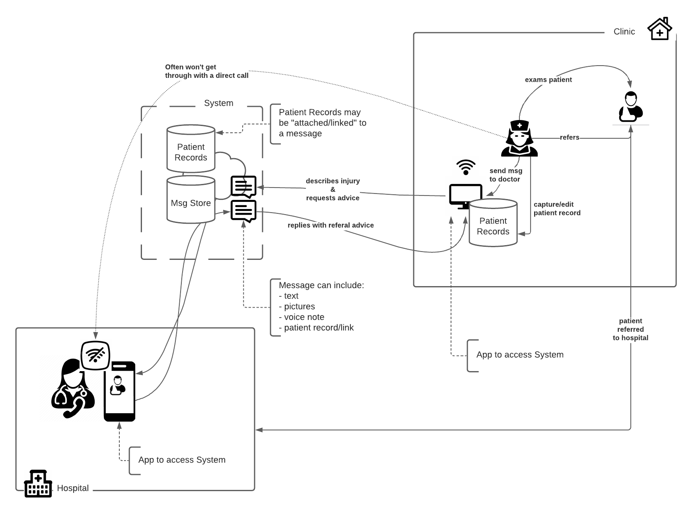

# Useful Diagrams

A small repository with examples of useful types of diagrams commonly used by tech teams.

## Table of Contents

- [Introduction](./introduction.md)
- [Generic](./generic.md)
- [Unified Modeling Language](./uml.md)
- [Flow Diagrams](./flow-diagrams.md)
- [Database](./erd.md)
- [Process Documentation](./bpmn.md)
- [Cyber-Security](./cyber-security.md)
- [Deployment](./deployment-diagrams.md)
- [Projects](./projects.md)
- [Architecture](./architecture.md)

      

---
&copy; Copyright 2021, Cyber-Mint (Pty) Ltd, and distributed under the MIT License.
