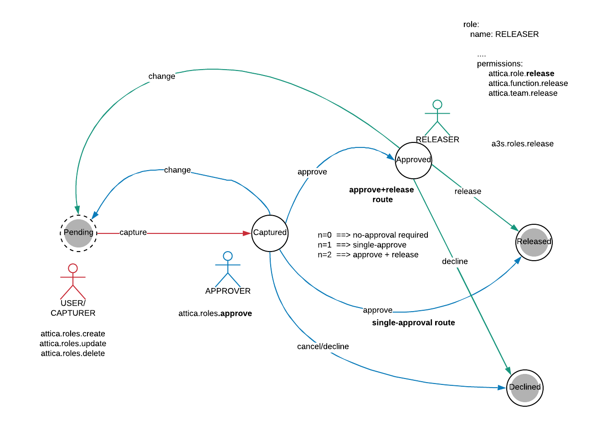
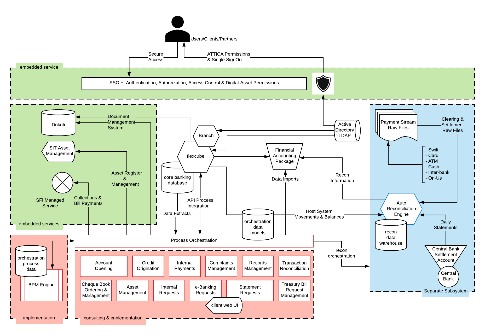

# Architecture
This is a domain where a variety of diagrams are used for a variety of purposes but these are some recognisable ones:
* Context Diagrams
* State Diagrams
* Solution Architecture Diagrams
* Enterprise Architecture Diagrams

## State Diagrams
Here is an example of a state diagram for a permission model that may be used by KYC system within a bank:

## Solution Architecture
These kinds of diagrams tend to closely reflect the underlying technology and will be drawn at different levels of abstraction as required.  Here is an example reflecting a solution architecture for a small model bank:

## Enterprise Architecture Diagrams
These too can conform to any number of industry norms and even "standards".  However what we tend to see is a pragmatic use of these sorts of diagrams as they tend to be extremely abstract (useful for sales teams & executive presentations) and a lot of nuance is lost in the restrictions of generalisation.

[[Back](./projects.md)] [[Home](./README.md)]
 

---
&copy; Copyright 2021, Cyber-Mint (Pty) Ltd, and distributed under the MIT License.