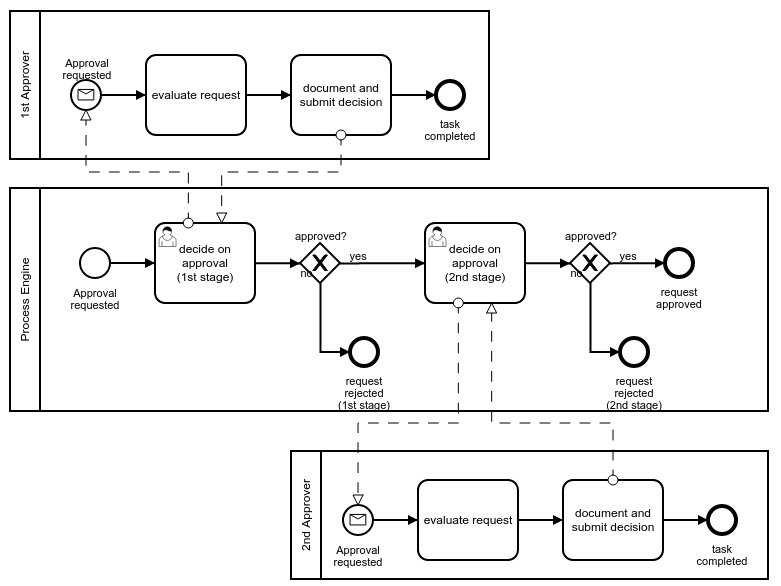

# Process Documentation

## Business Process Modeling Notation 2.0
Camunda is a excellent tool which has lots of [helpful resources](https://camunda.com/bpmn/examples/) for learning BPMN 2.0.

This example of a bpmn diagram is from that site.

[[Back](./erd.md)] [[Home](./README.md)] [[Next >> Cyber-Security Diagrams](./cyber-security.md)]
 

---
&copy; Copyright 2021, Cyber-Mint (Pty) Ltd, and distributed under the MIT License.