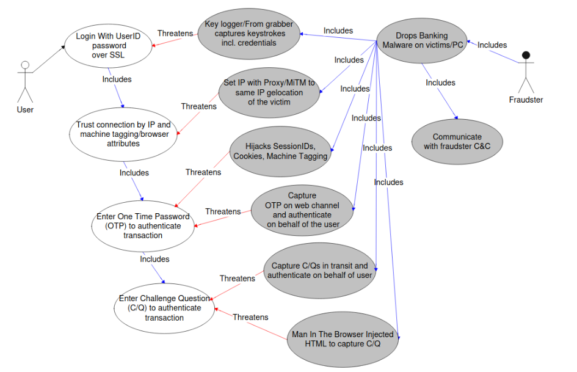
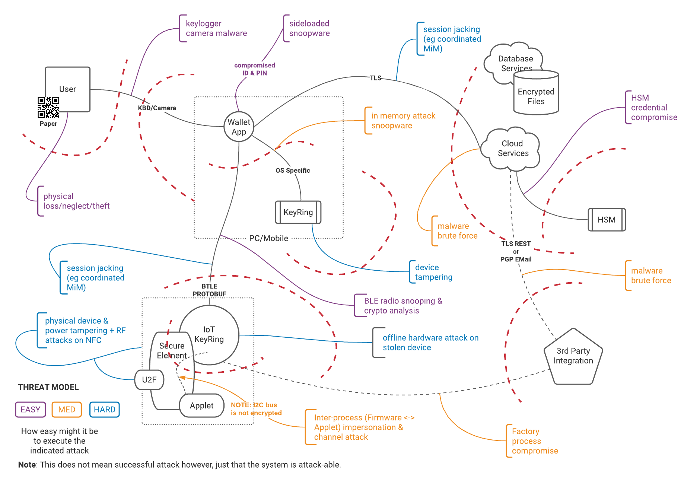
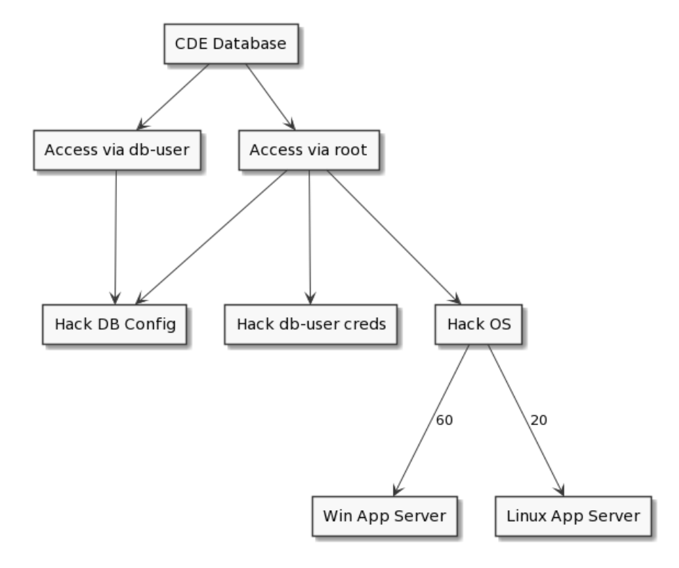

# Cyber-Security Diagrams

* Abuse Cases
* Threat Modeling
* Attack Tree

## Abuse Case Diagrams
An Abuse Case is very similar and indeed an extension of a Use Case Diagram.  It is intended to indicate to show what "Abuse Cases" **threaten** the Use Cases.  This is useful when trying to understand the security landscape in secure application development.

## Threat Model Diagram (STRIDE)
A STRIDE (Spoofing, Tampering, Repudiation, Information Disclosure, Denial of Service, Elevation of Privilege) threat model is very similar to a DFD but one which is used to highlight the threats faced within a system at (a) boundaries between entities, (b) data in transit, (c) data at rest, (e) within processes, and (e) by/from system actors.

## Attack Tree
An attack tree is a hierarchical & goal oriented way of representing (in the form of a threat tree) all possible attack surfaces and what precedents are required to achieve the next level of the attack tree.  Since it is goal oriented, an attack tree starts with a particular goal at the apex and systematically expands all possible/reasonably exploitable routes to achieving that attack goal.

This example shows the ultimate target of a Card Data Environment (CDE)

[[Back](./bpmn.md)] [[Home](./README.md)] [[Next >> Deployment Diagrams](./deployment-diagrams.md)]
 

---
&copy; Copyright 2021, Cyber-Mint (Pty) Ltd, and distributed under the MIT License.