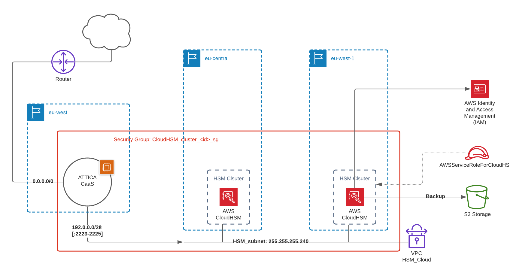
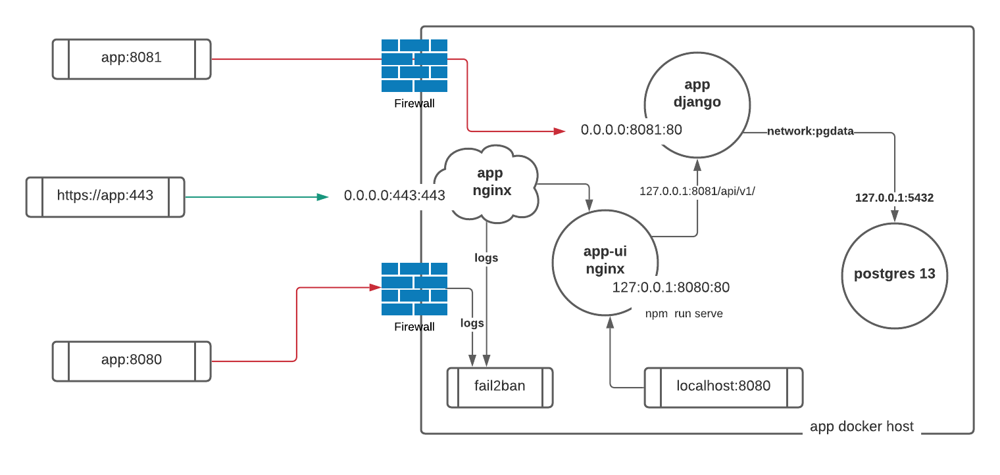

# Deployment Diagrams

Deployment diagrams come in all shapes and sizes.  There are UML packages, and proprietary diagrams offered by cloud service providers and simple representations of deployment details as may be required by a sysop or devops engineer.  We tend to use cloud deployment diagrams and docker/docker-compose based deployments.

## AWS Deployment Diagram
For this example we have chosen a high level AWS cloud deployment diagram showing AWS HSM services and an EC2 instance hosting the [ATTICA Crypto as a Service](https://attica.tech) solution, connected to a AWS Cloud HSM cluster with multi-regional redundancy.

## Docker-Compose Deployment Diagram
For a docker-compose deploy example we have looked at the deployment of a generic containerised Django backed, VueJS frontedn and a postgres database, all  behind a nginx reverse proxy on a hosted virtual machine.  In tis diagram we see some interesting deployment detail like the need for **firewall** configuration on the docker host VM to prevent docker port punch through.

[[Back](./cyber-security.md)] [[Home](./README.md)] [[Next >> Project Diagrams](./projects.md)]
 

---
&copy; Copyright 2021, Cyber-Mint (Pty) Ltd, and distributed under the MIT License.
