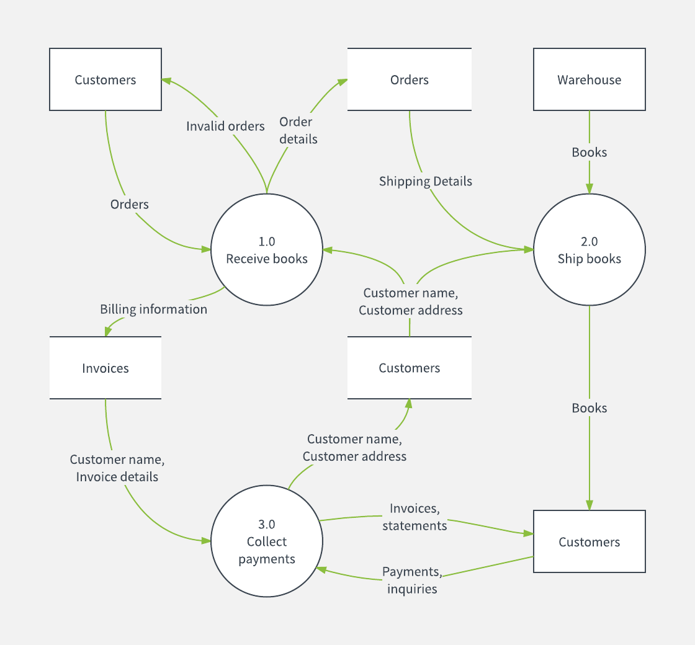

# Flow Diagrams

## Data Flow Diagram
The DFD is convenient to identify the flow of data, where it is originated/processed/transformed and where it is stored.

The following example by Lucidchart is self explanatory

[[Back](./uml.md)] [[Home](./README.md)] [[Next >> Database Diagrams](./erd.md)]
 

---
&copy; Copyright 2021, Cyber-Mint (Pty) Ltd, and distributed under the MIT License.