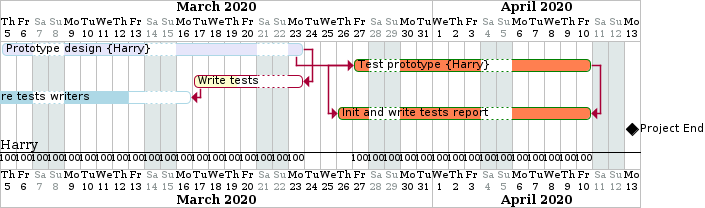
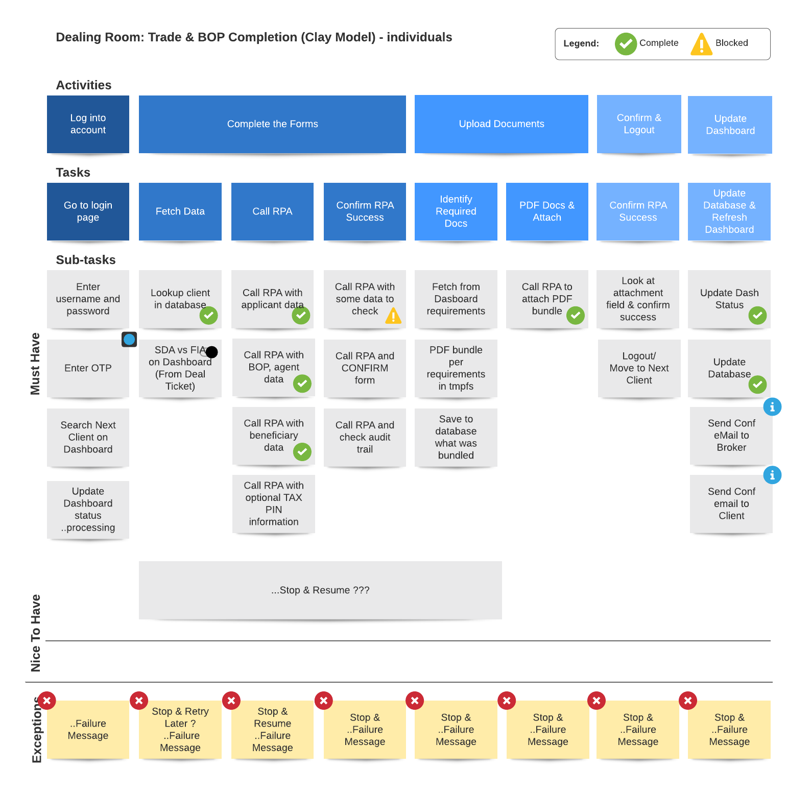

# Project Diagrams
We make use of several diagram types or visualisations in project planning, such as: 
* Gantt Charts
* Mindmap
* User Story Mapping

## Gantt Chart

Planuml has a rudamentary ability to generate gantt charts which is useful when autogeneration is required.  The following code is rendered below:

```
@startgantt
  Project starts 2020/03/05
  printscale daily
  saturday are closed
  sunday are closed
  [Prototype design] on {Harry} lasts 13 days and is colored in Lavender/LightBlue
  [Test prototype] on {Harry} lasts 11 days and is colored in Coral/Green and starts 3 days after [Prototype design]'s end
  [Write tests] lasts 5 days and ends at [Prototype design]'s end
  [Write tests] is 40% completed 
  [Hire tests writers] is colored in lightblue and lasts 9 days and ends at [Write tests]'s start
  [Hire tests writers] is 70% completed
  [Init and write tests report] is colored in Coral/Green
  [Init and write tests report] starts 1 day before [Test prototype]'s start and ends at [Test prototype]'s end
  [Project End] happens at 2020/04/11
@endgantt
```



## User Story Mapping
Here is an interesting example of a user story mapping which was done in Lucidchart:




[[Back](./deployment-diagrams.md)] [[Home](./README.md)] [[Next >> Architecture](./architecture.md)]
<br>

---
&copy; Copyright 2021, Cyber-Mint (Pty) Ltd, and distributed under the MIT License.