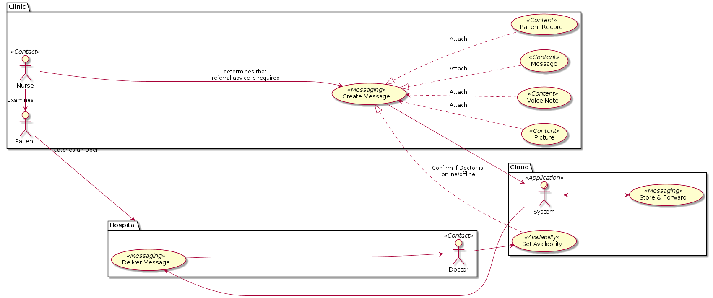
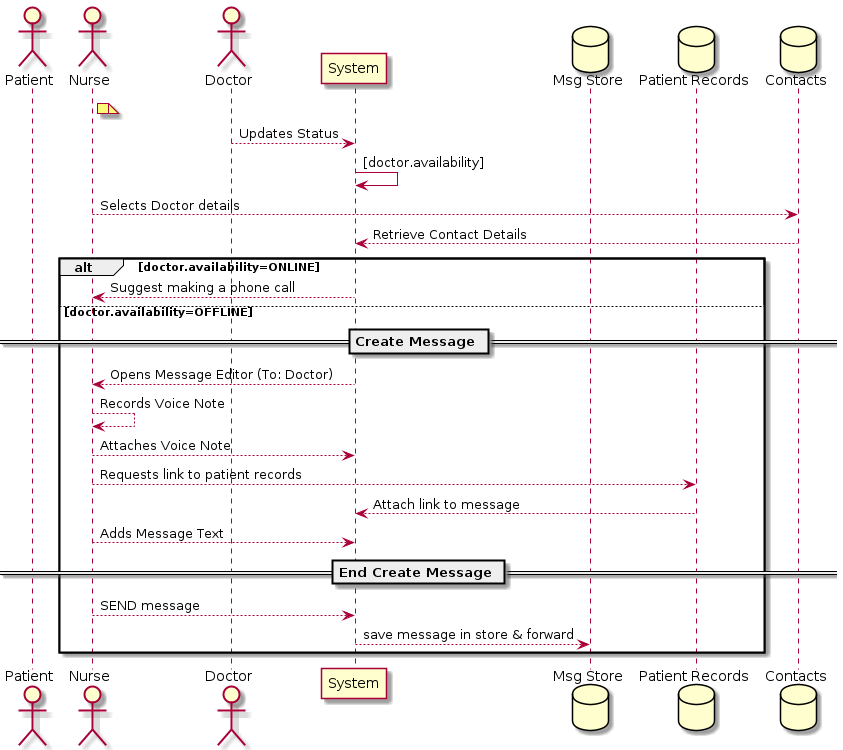
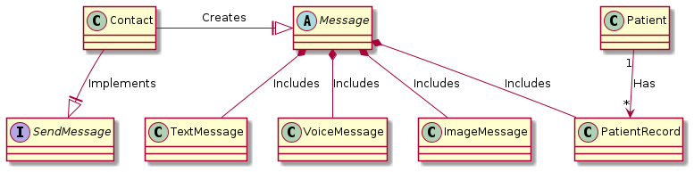

# UML Diagrams

Although UML is extensive we tend to only make use of a few diagram types:

* Use Case Diagram
* Sequence Diagram
* Class Diagram

## Use Case Diagram

## Sequence Diagram

## Class Diagram

[[Back](./generic.md)] [[Home](./README.md)] [[Next >> Flow Diagrams](./flow-diagrams.md)]
 

---
&copy; Copyright 2021, Cyber-Mint (Pty) Ltd, and distributed under the MIT License.